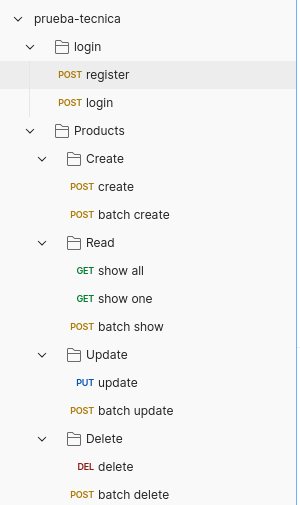

# Prueba técnica de José Alberto Ruiz Cruz

## Requerimientos:

- php 8.3
- composer 2.7.7
- mysql 8.0.39
- Laravel Framework 11.20.0

## Instrucciones:

- Clonar el repositorio y ejecutar:
    - cd jose-alberto-ruiz-cruz
- Installar las dependencias del proyecto:
    - composer install
- Cambiar las credenciales de mysql en el archivo .env a las de tu entorno de desarrollo, justo en estas lineas:
    
    **DB_CONNECTION=mysql**
    
    **DB_HOST=127.0.0.1**
    
    **DB_PORT=3306**
    
    **DB_DATABASE=your_database**
    
    **DB_USERNAME=your_username**
    
    **DB_PASSWORD=your_password**
    
- Ejecutar las migraciones del proyecto y cargar datos falsos:
    - php artisan migrate —seed
- Se ejecuta el servidor web y se activa la cola de procesamientos en segundo plano
    - php artisan serve | php artisan queue:work
- Se puede probar desde postman, se adjunta colección lista para probar:
    - https://drive.google.com/file/d/1P3kHGDzRHav8kAGyW0x9b7u3pibUjKWP/view?usp=drive_link

## Colección de postman:

La estructura de la colección es la siguiente:

### Carpeta login:

Contiene la petición de registrar y loguear un usuario.

### Carpeta products:

Contiene las carpetas con las peticiones para Crear, Leer, Actualizar y Eliminar Productos.(CRUD).

Tanto para caso unico como por lote (en Batch).

## Comentarios y mejoras para el proyecto.

Se utilizó laravel como framework base.

Para autenticación se utilizó la librería Laravel Sanctum.

Se utilizaron transacciones para el manejo de concurrencia.

Se utilizó jobs y queues para el manejo de peticiones asíncronas.

Actualmente no se avisa al frontend cuando finaliza una petición por Lote, sería una opción de mejora.